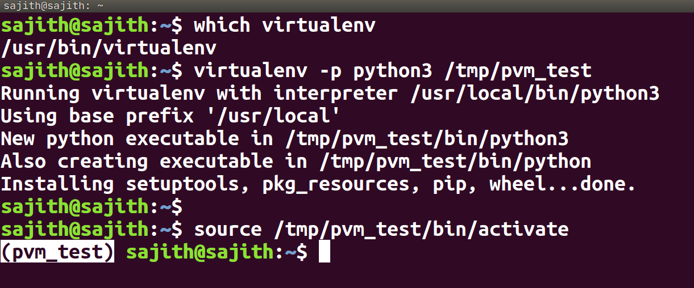

#### What is a PVM?, How to create a PVM?.

##### What? : [VM,](https://en.wikipedia.org/wiki/Virtual_machine)  A python virtual machine(PVM) is simply a program which provides a general programming environment -- a program which can be programmed.

##### How? : In a Linux environment we can use following commands to create PVM.

###### Install PVM in Ubuntu([For Windows](https://www.geeksforgeeks.org/creating-python-virtual-environment-windows-linux/)).
```bash

sudo apt-get install virtualenv  # sudo python3 -m pip install virtualenv
```

###### Create a PVM in a Ubuntu.
```bash
#To create a directory for PVM
mkdir -p <path> # mkdir -p /tmp/pvm_test # This is optional
#Create a PVM by using Python 3
virtualenv -p python3 /tmp/pvm_test
#Activate created PVM
source <path to pvm bin active > # source /tmp/pvm_test/bin/activate
```

##### Summary outputs


#### How to install [packages](https://pypi.org/search/) in PVM

```bash
python -m pip install <package names> # python -m pip install requests
```


